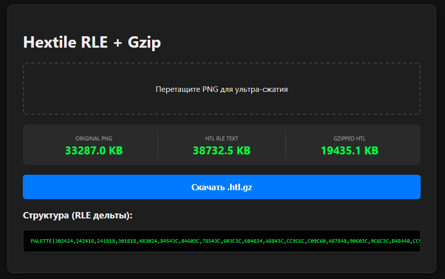

# 🚀 Hextile Engine

A high-performance custom image compression format designed for large-scale textures (4K+) in game engines. Hextile outperforms standard PNG by utilizing **Base36 RLE-Delta encoding** combined with Gzip.

## 📊 Benchmark: PNG vs Hextile
Testing on a 4K Satellite Terrain Texture (3840x2160):
- **Original PNG:** 33.2 MB
- **Gzipped Hextile:** 19.4 MB
- **Compression Ratio:** **~1.7x smaller than PNG**

## ✨ Features
- **RLE-Delta Encoding:** Specialized for patterns and large areas of similar colors.
- **Base36 Serialization:** Ultra-short character representation for coordinates and indices.
- **Engine-Ready:** Designed to be parsed directly into a Collision Map or Logic Grid.
- **Quantization:** Built-in color optimization to reduce noise.
- **Progressive Rendering:** Integrated visualizer to see image reconstruction layer-by-layer.
- **Real-time Studio:** Interactive GUI with live quantization (1-64) and size estimation.

---

## 🇷🇺 О проекте (Russian)
**Hextile Engine** — это кастомный формат сжатия изображений, оптимизированный для 4K текстур ландшафтов. 

### Почему это круто?
Стандартный PNG плохо справляется с избыточностью в огромных разрешениях. Hextile использует разницу между индексами пикселей (дельты) и повторители (RLE), упаковывая всё в Base36. Результат — текстура земли весит **на 40% меньше**, чем PNG, при сохранении высокой детализации.

---

## 🛠 Project Structure
- `/src/encoder`: Logic for converting PNG/Raw data to `.htl`.
- `/src/decoder`: High-speed Reader for web and engine integration.
- `/src/demo`: Web-based converter and visualizer.

## 🚀 Quick Start
1. Clone the repo: `git clone ...`
2. Install dependencies: `npm install`
3. Run demo: Open `src/demo/test-encoder.html` in your browser.

## 📜 License
MIT